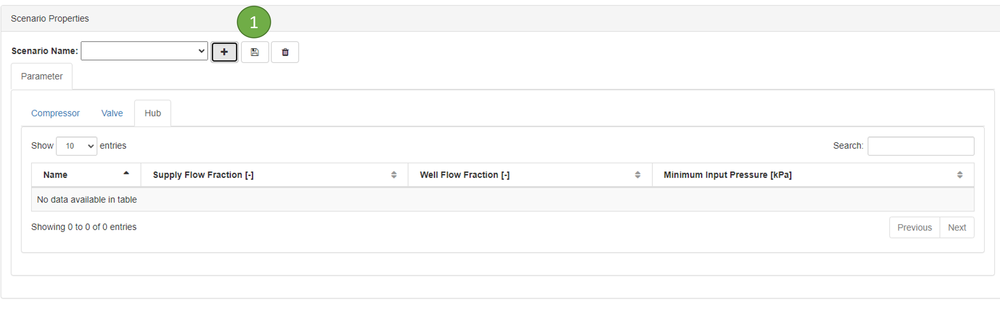

Setting the scenario
----------------------------------------------

Scenario defined as a parameter of a component that can be changed over the time. For example the setpoint of CO2 flowrate

The value of each column has this format: *date value*. Date format is *day-month-year hour:minute*

Example:
    * 1-jan-2022 100
    * 1-jan-2022 01:00 150

When you have several values, then you can add by using *comma*

Example:
    * 1-jan-2022 100, 3-apr-2022 200

Create scenario
~~~~~~~~~~~~~~~~~~~~~~~~~~~~~~~~~~~~~~~~~~~~~~~~
* Click + button to create a new scenario
* Fill in the scenario name
* The default parameter list will be presented in the table if the network contains the component

.. image:: images/newscenario.png
    :width: 500

Compressor
""""""""""""""""""""""""""""""""""""""""""""""""""
    * **Flow Setpoint**. To determine the setpoint flowrate outgoing of the compressor.

Hub
""""""""""""""""""""""""""""""""""""""""""""""""""
    * **Supply Flow Fraction**. To determine the fraction of flow going into the hub. If there is multiple hubs, then the total fraction should be equal to 1
    * **Minimum Input Pressure**. To determine the minimum pressure at the inlet of the hub
    * **Well flow Fraction**. To determine the allocation of each well connected to the hub. If there are more than 1 wells, then the value should match with the number of wells. For example 3 wells: *1-jan-2022 0.3 0.4 0.3*

Open an existing scenario
~~~~~~~~~~~~~~~~~~~~~~~~~~~~~~~~~~~~~~~~~~~~~~~~
* Select existing scenario from the drop down list

.. image:: images/scenariobutton.png
    :width: 500

Save a scenario
~~~~~~~~~~~~~~~~~~~~~~~~~~~~~~~~~~~~~~~~~~~~~~~~
* Click save button to save scenario

.. image:: images/scenariobutton.png
    :width: 500

Delete a scenario
~~~~~~~~~~~~~~~~~~~~~~~~~~~~~~~~~~~~~~~~~~~~~~~~
* Click trash button to delete scenario
* *note*: there is no popup window asking confirmation

.. image:: images/scenariobutton.png
    :width: 500

